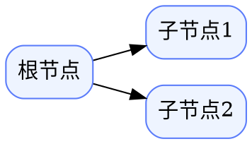

# dotdesk Development Workflow

## 项目概述

`dotdesk` 是一个基于 Graphviz DOT 的思维导图桌面应用。

- **技术栈**: Tauri v2 (Rust) + React + TypeScript + Vite + Monaco Editor
- **后端**: Rust Tauri commands 封装 Graphviz `dot -Tsvg`
- **前端**: React 状态管理 + Monaco 文本编辑器 + 内联 SVG 预览
- **导图模式**: 从 DOT 源文本自动渲染为思维导图 SVG

## 什么时候使用

- 启动新功能开发时，需要同步更新文档体系
- 开发导图交互功能（键盘导航、节点编辑、渲染导出）
- 调试 Tauri IPC、Graphviz 渲染或文件操作
- 每次提交前归档对话日志和更新计划文档
- 处理 Rust 后端错误或 Graphviz 路径问题

## 文档体系

### 必须维护的文件

| 文件 | 用途 | 更新时机 |
|------|------|----------|
| `README.md` | 项目简介、安装、使用说明 | 每次有重大变更时 |
| `CHANGELOG.md` | 版本变更记录 | 每次提交时追加 |
| `docs/SESSION_LOG.md` | 对话日志归档 | 每次对话结束时（最新在前） |
| `docs/plan.md` | 当前/下一阶段计划 | 每次变更计划时 |

### 创建/更新流程

1. **README.md**: 项目名称、技术栈、功能列表、快速开始、截图（如有）
2. **CHANGELOG.md**: 按日期/版本号组织，格式 `## [YYYY-MM-DD]`，描述变更内容
3. **docs/SESSION_LOG.md**: 每次对话结束，将关键决策、变更摘要追加到顶部
4. **docs/plan.md**: 明确 MVP 范围、分阶段任务、完成状态标记

## 导图功能开发规范

### 数据结构

```typescript
interface MindMapNode {
  id: string;
  label: string;
  children: MindMapNode[];
}

interface MindMap {
  root: MindMapNode;
}
```

### 快捷键映射

| 按键 | 动作 |
|------|------|
| `Tab` | 创建子节点 |
| `Enter` | 创建兄弟节点 |
| `双击/空白` | 编辑节点内容 |
| `Delete` | 删除节点 |

### 从节点树生成 DOT

将 `MindMapNode` 树递归转换为 DOT 有向图：



### 渲染流程

1. 用户编辑导图节点树（React state）
2. 将节点树序列化为 DOT 源码
3. 通过 Tauri IPC 调用 `render_dot_to_svg`
4. Rust 后端执行 `dot -Tsvg`，返回 SVG
5. 前端通过 `dangerouslySetInnerHTML` 渲染 SVG 预览

## 开发步骤（新功能）

1. **设计数据结构** — 在 `src/types.ts` 中定义接口
2. **实现组件** — 在 `src/components/` 下创建新组件
3. **集成状态** — 在 `App.tsx` 中连接状态和事件
4. **测试渲染** — 使用 `renderDot` 验证 SVG 输出
5. **更新文档** — 更新 `CHANGELOG.md` 和 `docs/`

## Tauri 调试技巧

- Graphviz 检测：`invoke<GraphvizStatus>('check_graphviz')`
- 渲染调用：`invoke<RenderResult>('render_dot_to_svg', { source })`
- 文件操作：使用 `@tauri-apps/plugin-dialog` 的 `open`/`save`
- 环境变量 `DOTDESK_GRAPHVIZ_DOT` 可指定自定义 `dot` 路径

## 常见问题

- **Graphviz 未找到**: 运行 `brew install graphviz` 或设置环境变量 `DOTDESK_GRAPHVIZ_DOT`
- **DOT 语法错误**: 检查 Monaco 编辑器中的 DOT 源码，错误信息显示在 Render Log 面板
- **SVG 不显示**: 确认 `render_dot_to_svg` 返回的 `ok` 为 `true`
