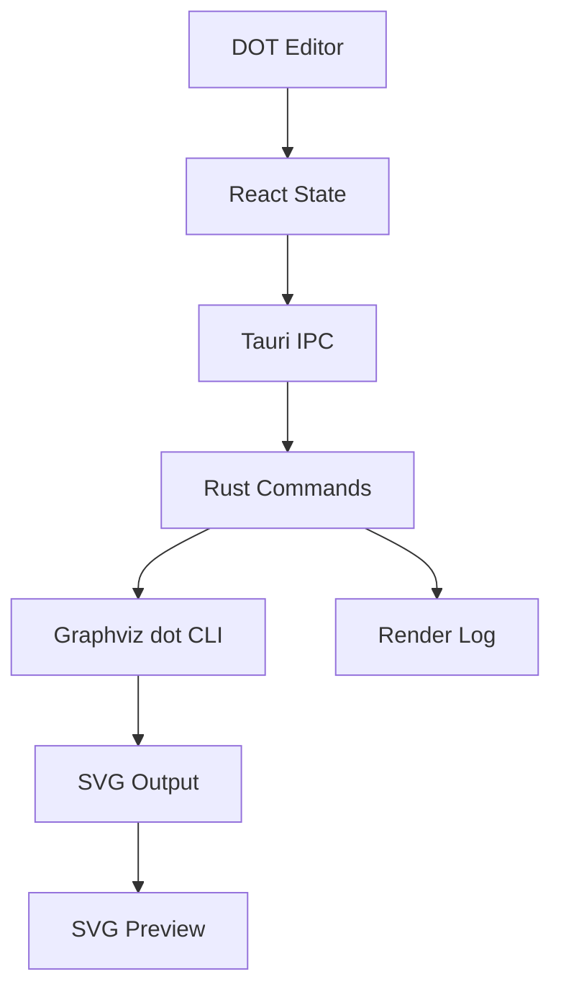

# dotdesk 架构文档

`dotdesk` 是一个跨平台桌面 DOT 绘图工具。第一版聚焦 `.dot` / `.gv` 文件的编辑、渲染、预览和导出闭环。LaTeX 集成不进入 MVP，只作为后续扩展方向保留。

## 目标

- 使用桌面级代码编辑器编辑 DOT 源码。
- 通过本地 Graphviz `dot` 命令渲染 DOT。
- 在应用内预览 SVG 输出。
- 打开和保存本地 DOT 文件。
- 将渲染结果导出为 SVG。
- 清晰展示 Graphviz 缺失、DOT 语法错误和渲染日志。

## MVP 不包含

- LaTeX 编译 UI。
- PDF 文档模板生成。
- Mermaid 或 PlantUML 兼容。
- 节点点击反向定位源码。
- 插件市场或模板市场。

## 技术栈

- Tauri v2：桌面壳、本地命令、打包和文件权限。
- React + TypeScript + Vite：前端应用。
- Monaco Editor：DOT 编辑器。
- Rust Tauri commands：Graphviz 检测和渲染封装。
- 本地 Graphviz CLI：DOT 渲染器。

## 运行流程

前端将当前 DOT 源码保存在 React state 中。用户点击 Render 时，应用调用 `render_dot_to_svg` Tauri command。Rust 后端启动 `dot -Tsvg`，通过 stdin 写入 DOT 源码，捕获 stdout 和 stderr，然后把结构化结果返回给前端。

## 模块边界

- `src/App.tsx` 负责应用状态，并协调文件操作、Graphviz 检测、渲染和导出；思维导图模式下持有 `mindMapRoot`、`dotStyle`、`edgeStyles` 及节点/边选中集合，驱动 `mindMapToDot` 与预览。
- `src/components/DotEditor.tsx` 封装 Monaco，提供受控编辑器接口。
- `src/components/MindMap.tsx` + `MindMapNodeView.tsx`：ReactFlow 画布（拖动、多选、边选中、dagre 初布局）；`mindMapToDot` 从此模块导出。
- `src/components/DotStylePanel.tsx`：DOT 样式边栏，按画布选中上下文切换 Graph/Node/Edge 区块。
- `src/components/SvgPreview.tsx` 渲染 SVG 预览区域。
- `src/components/RenderLog.tsx` 展示 Graphviz 状态和渲染输出。
- `src-tauri/src/graphviz.rs` 负责所有与 `dot` 二进制命令的直接交互。
- `src-tauri/src/lib.rs` 注册插件和 Tauri commands。

交互画布实现细节见 `docs/interactive-canvas.md`。

## 本地命令

`check_graphviz` 执行 `dot -V` 并返回：

- `available`：命令是否可用。
- `version`：检测到的版本信息。
- `message`：面向用户的状态说明。

`render_dot_to_svg` 执行 `dot -Tsvg`，通过 stdin 写入 DOT 源码，并返回：

- `ok`：渲染是否成功。
- `svg`：渲染成功时的 SVG 内容。
- `stdout`：失败时的 Graphviz stdout。
- `stderr`：Graphviz 诊断信息。

## 文件操作

MVP 使用 Tauri dialog 和 filesystem 插件打开、保存 `.dot` / `.gv` 文件，并导出 `.svg`。权限范围限制在 `$HOME/**`，既支持 `Documents` 下的本地开发，也避免过宽的文件系统访问。

## 错误处理

应用将 Graphviz 视为外部依赖。如果 `PATH` 中找不到 `dot`，编辑器仍然可用，渲染日志会显示缺失命令的错误信息。DOT 语法错误由 Graphviz stderr 返回，并直接展示在日志区域中，应用不会崩溃。

## 后续 LaTeX 扩展

LaTeX 支持可以作为独立本地模块加入，例如 `src-tauri/src/latex.rs`。Rust 层可以调用 `latexmk`、`xelatex` 或 `lualatex`，并把日志和生成的 PDF 路径返回给前端。该扩展应与 DOT 渲染路径保持隔离，确保 DOT 编辑和预览始终快速、稳定。
