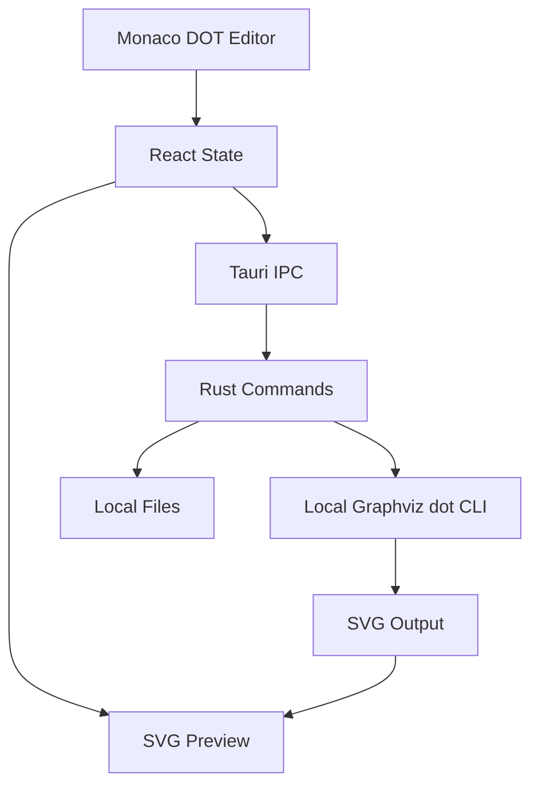

# dotdesk 框架文档计划

## 项目定位

`dotdesk` 是一个跨平台桌面 DOT 绘图工具，第一版聚焦 Graphviz DOT 的编辑、预览、错误反馈和导出。应用优先使用本机 Graphviz 环境渲染，后续可扩展 LaTeX、本地模板、多格式文档生成等能力。

## 推荐架构

- 桌面壳：[Tauri](https://tauri.app/) 负责跨平台打包、本地命令调用和文件系统访问。
- 前端：[React](https://react.dev/) + TypeScript + Vite。
- 编辑器：[Monaco Editor](https://microsoft.github.io/monaco-editor/) 提供 DOT 编辑体验。
- 后端命令层：Rust Tauri commands，封装 `dot` 命令检测、渲染、导出和日志返回。
- DOT 渲染：优先调用本地 `dot -Tsvg`，后续可增加 WASM fallback。

## MVP 功能范围

- 新建、打开、保存 `.dot` 文件。
- Monaco 编辑 DOT 源码。
- 调用本地 Graphviz 生成 SVG。
- 右侧实时或手动刷新 SVG 预览。
- 显示 Graphviz stdout/stderr 和解析错误。
- 导出 SVG。
- 可选导出 PNG/PDF，但若实现成本超出第一轮，可放入第二阶段。

## 非 MVP 范围

- LaTeX 编译 UI。
- PDF 文档模板系统。
- Mermaid / PlantUML 兼容。
- 节点点击反向定位源码。
- 插件系统或模板市场。

LaTeX 会保留为后续扩展方向：未来可以通过 Tauri Rust 后端调用本地 `latexmk` / `xelatex`，用于把 DOT 图嵌入技术文档或生成完整 PDF。

## 建议目录结构

执行阶段建议在 `/Users/lion/Documents/dotdesk` 创建项目：

- `package.json`：前端依赖和脚本。
- `src/App.tsx`：主界面布局。
- `src/components/DotEditor.tsx`：DOT 编辑器。
- `src/components/SvgPreview.tsx`：SVG 预览。
- `src/components/RenderLog.tsx`：渲染日志。
- `src-tauri/src/lib.rs`：Tauri 命令入口。
- `src-tauri/src/graphviz.rs`：Graphviz 检测和渲染封装。
- `docs/architecture.md`：长期维护的架构文档。

## 执行阶段步骤

1. 在 `/Users/lion/Documents/dotdesk` 初始化 Tauri + React + TypeScript 项目。
2. 添加 Monaco Editor 和基础 UI 布局。
3. 实现 Rust `render_dot_to_svg` 命令，调用本地 `dot -Tsvg`。
4. 前端接入命令调用，完成 DOT 到 SVG 的预览闭环。
5. 添加文件打开/保存能力。
6. 添加 Graphviz 环境检测和错误日志展示。
7. 编写 `docs/architecture.md`，记录架构、模块边界、MVP/非 MVP 范围和后续 LaTeX 扩展路线。

## 验证标准

- 启动开发环境后可以编辑默认 DOT 示例并看到 SVG 预览。
- 本地缺少 Graphviz 时能给出清晰错误提示。
- DOT 语法错误时能展示 Graphviz stderr。
- `.dot` 文件可打开、保存。
- `docs/architecture.md` 与实际项目结构一致。

## 完成状态

- 已完成：在 `/Users/lion/Documents/dotdesk` 初始化 Tauri + React + TypeScript 项目。
- 已完成：实现 DOT 编辑、Graphviz 渲染、SVG 预览和日志反馈。
- 已完成：添加 `.dot` 文件打开、保存和 SVG 导出能力。
- 已完成：创建 `docs/architecture.md`，记录项目架构、MVP 边界和后续 LaTeX 扩展方向。
- 已完成：验证开发环境和 DOT 渲染闭环的可执行部分。
