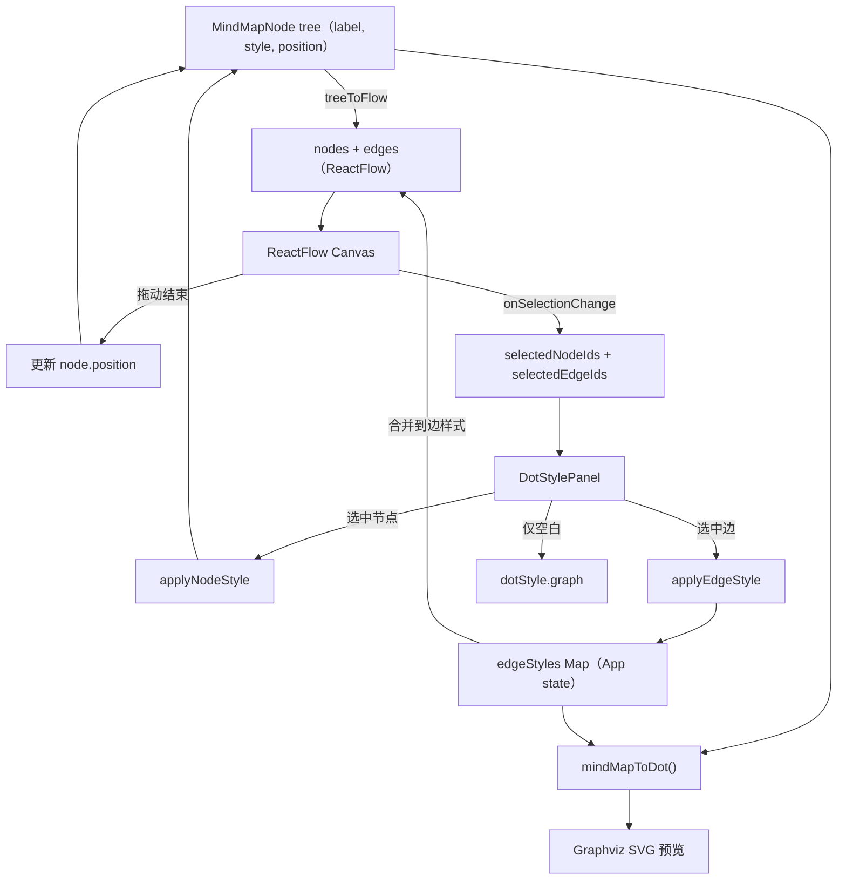

# 交互画布（Mind Map / ReactFlow）

本文档归档「思维导图 → ReactFlow 画布」改造后的实现要点，便于后续维护与扩展。对应计划见仓库根目录下的 Interactive Canvas Mind Map 方案（不修改计划文件本身）。

## 目标

- 树形 `MindMapNode` 仍为结构真相来源（Tab/Enter 语义依赖父子关系）。
- 画布层使用 `@xyflow/react`：节点拖动、多选、框选、边可选中。
- 边样式独立存放在 App 级 `EdgeStyleMap`，与树一并驱动 `mindMapToDot`。
- 左侧 `DotStylePanel` 根据选中类型展示 Graph / Node / Edge。

## 数据流

## 类型（`src/types.ts`）

| 符号 | 说明 |
|------|------|
| `MindMapNode.position` | 可选 `{ x, y }`，画布坐标；不写回 DOT 的 `pos`，仅供前端布局 |
| `EdgeStyleMap` | `Record<string, Partial<EdgeStyle>>`，键为 `"sourceId->targetId"`，与 ReactFlow `edge.id` 一致 |
| `SelectionState` | `{ nodes: string[]; edges: string[] }`（可选用途） |

## 主要文件

| 路径 | 职责 |
|------|------|
| `src/main.tsx` | 引入 `@xyflow/react/dist/style.css` |
| `src/components/MindMap.tsx` | ReactFlow 画布、`treeToFlow`、`computeMissingLayout`（dagre）、`mindMapToDot`、键盘与选择上报 |
| `src/components/MindMapNodeView.tsx` | 自定义节点：样式、选中态、双击编辑、Handle |
| `src/components/DotStylePanel.tsx` | 上下文感知：空白→Graph；仅节点→Node；仅边→Edge；混合→Node+Edge |
| `src/App.tsx` | `dotStyle`、`edgeStyles`、`selectedNodeIds`/`selectedEdgeIds`、`applyNodeStyle`/`applyEdgeStyle` |
| `src/styles.css` | `.mindmap-canvas`、ReactFlow 暗色适配、`.mm-rf-node` 等 |

## ReactFlow 行为摘要

- `selectionOnDrag` + `panOnDrag={[1, 2]}`：左键拖拽框选；中键/右键平移。
- `multiSelectionKeyCode={['Control','Meta']}`：Ctrl/Cmd 点选叠加。
- `selectionKeyCode="Shift"`：与框选配合。
- `nodesConnectable={false}`：不允许用户自由连线（保持树）。
- `deleteKeyCode={null}`：删除键由自定义 `handleKeyDown` 处理节点删除。

## 初始布局（dagre）

- `computeMissingLayout`：若节点尚无可用 `position`（视为需布局），对全部节点跑一次 dagre；布局结果写回树中的 `position`（首次加载一次性同步）。
- 用户拖动后位置保存在树中，后续不再被 dagre 覆盖。

## DOT 输出（`mindMapToDot`）

- 第三个参数 `edgeStyles`：每条父子边可带 `[color="...", penwidth=...]` 等内联属性。
- 节点 `position` **不**写入 DOT；Graphviz 仍按 rankdir 等自行排版预览侧 SVG（画布与预览布局可能不一致，属已知取舍）。

## 键盘（当前实现）

| 按键 | 行为 |
|------|------|
| Tab | 为当前 active 节点添加子节点 |
| Enter | 添加兄弟节点（根上等同于子节点） |
| Delete / Backspace | 删除选中节点（不含根） |

以下在计划中提及，**当前代码未实现**：Space 进入编辑、方向键在树中导航；如需对齐计划需后续补充。

## 后续扩展（参见计划「渐进迁移」）

- 自由连线、仅删除边、复制粘贴、撤销重做等。
