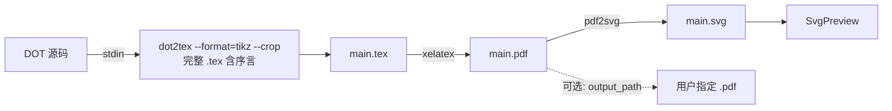

# LaTeX 渲染管道

dotdesk 的 SVG 预览支持两个引擎：

| Engine | 命令 | 用途 |
|--------|------|------|
| `dot`  | `render_dot_to_svg` | 直接 `dot -Tsvg`，速度快 |
| `latex` | `compile_via_latex` | 走 `dot2tex → xelatex → pdf2svg`，可处理公式 |

引擎切换在 `SvgPreview` 头部的 segmented toggle 或 macOS 菜单 `Render → Engine: ...` 中触发。

## 依赖

LaTeX 管道需要本机存在三个外部工具：

| 工具 | 检查项 | 安装建议（macOS） |
|------|--------|-------------------|
| `xelatex` | `xelatex --version` | [MacTeX](https://www.tug.org/mactex/) 或 `brew install --cask mactex-no-gui` |
| `dot2tex` | `dot2tex --version` | `pip install dot2tex` |
| `pdf2svg` | 存在性 | `brew install pdf2svg` |

**查找规则（与 Graphviz `dot` 一致）**：只在当前进程的 **`PATH` 环境变量** 的各个目录里查找可执行文件；**不会**猜测 Homebrew、pip 用户目录等固定路径。

可选环境变量用于显式指定**完整路径**（绕过 PATH）：
- `DOTDESK_XELATEX` — `xelatex` 可执行文件
- `DOTDESK_DOT2TEX` — `dot2tex` 可执行脚本
- `DOTDESK_PDF2SVG` — `pdf2svg` 可执行文件
- `DOTDESK_PYTHON` — 解释器路径；若 PATH 中无 `dot2tex` 脚本，会尝试该解释器执行 `python -m dot2tex`（解释器本身仍须能通过 PATH 或本变量找到）

桌面应用从 Dock/Finder 启动时，`PATH` 往往比终端里更短。若工具已安装却检测不到，请任选其一：
- 在启动环境中把工具所在目录加入 `PATH`（例如通过 `launchctl setenv`、Automator 包装脚本、或从已配置好 PATH 的终端执行应用），或
- 设置上述 `DOTDESK_*` 指向绝对路径。

通过菜单 `Render → Check LaTeX` 触发 `check_latex` 命令，会在 RenderLog 区域显示三件套的可用性。

## 数据流



## 临时目录

所有中间产物（`main.tex` / `main.pdf` / `main.svg` / 辅助文件）写到 `${TMPDIR}/dotdesk-latex/`，
进程内复用，不强制清理。导出 PDF 时把 `main.pdf` 复制到用户选择的路径。

## 命令签名

```rust
#[tauri::command]
pub fn check_latex() -> LatexStatus;

#[tauri::command]
pub fn compile_via_latex(
    source: String,
    output_path: Option<String>,
) -> Result<LatexRenderResult, String>;
```

`LatexRenderResult` 形状与 `RenderResult` 兼容（多了 `pdf_written: bool`），前端复用同一渲染日志展示。

## 错误处理

| 失败点 | 表现 | 排查 |
|--------|------|------|
| 三件套缺失 | `compile_via_latex` 返回 `Err`，UI 显示错误 | 跑 `Check LaTeX` 看缺哪个 |
| dot2tex 报错 | `ok=false`，stderr 含 dot2tex 报错 | 通常是 DOT 语法或 `--shell-escape` 限制 |
| xelatex：`Undefined color strokecolor` 等 | TikZ 用了 Graphviz 颜色名但序言缺定义 | dotdesk 使用 dot2tex **完整文档**输出（非 `--codeonly`），序言里应含 `\definecolor{strokecolor}{...}`；若仍报错，升级 dot2tex 或简化 DOT 中自定义颜色 |
| xelatex：`I do not know the key '/tikz/rounded'`、`filled` | dot2tex 把 Graphviz `rounded,filled` 写成非法 TikZ 键名 | dotdesk 在 `\begin{document}` 后注入 `\tikzset{rounded/.style={rounded corners=3pt},filled/.style={fill=fillcolor}}` |
| xelatex：`Undefined color 'fillcolor'` | 序言未定义 `fillcolor` 却已使用 `filled` | 同上注入处增加 `\providecolor{fillcolor}{HTML}{EEF4FF}`（及 `strokecolor` 兜底），与默认导图配色接近且不与 dot2tex 已有定义冲突 |
| xelatex 编译失败 | `ok=false`，stdout 为完整 `.log` | 看 `! LaTeX Error:` 行 |
| pdf2svg 失败 | `ok=false`，stderr 含 pdf2svg 输出 | 看 PDF 是否生成 |

## 模板

`src-tauri/src/latex.rs` 中 `TEX_TEMPLATE` 默认引入 `amsmath`、`amssymb`、`tikz` 与若干常用库。
若需要更多宏包，编辑该常量；后续若把模板改为可配置，会把它独立成资源文件。

## 后续扩展

- 让模板可配置（用户级 `~/.dotdesk/preamble.tex`）
- 支持 LuaLaTeX
- 增量编译 + 缓存（按 DOT 源码 hash 跳过重复编译）
- 失败时把 `.log` 中的 `! ... l.NN ...` 行解析到日志面板
